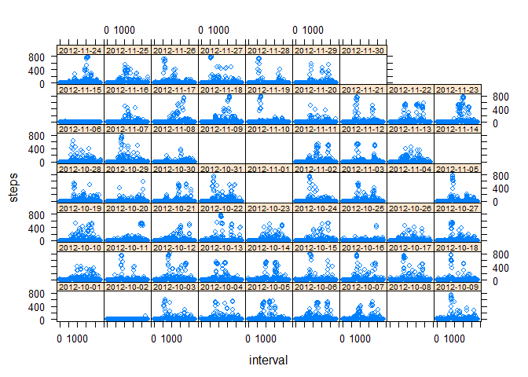
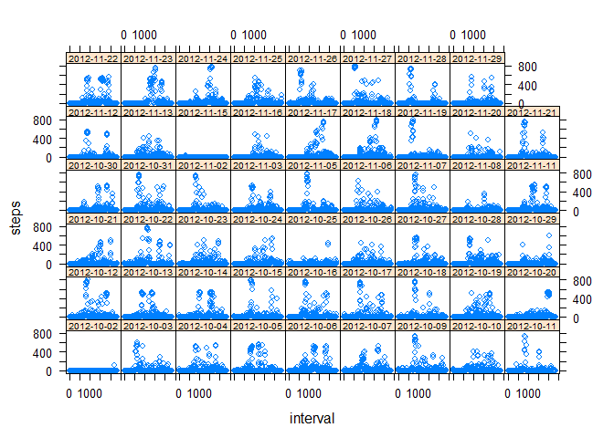
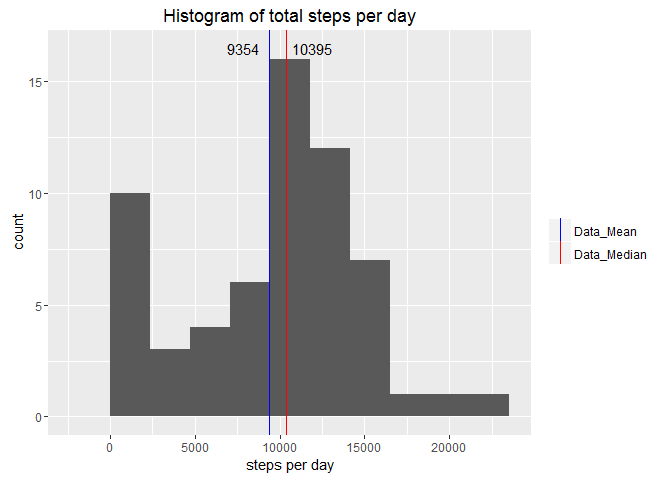
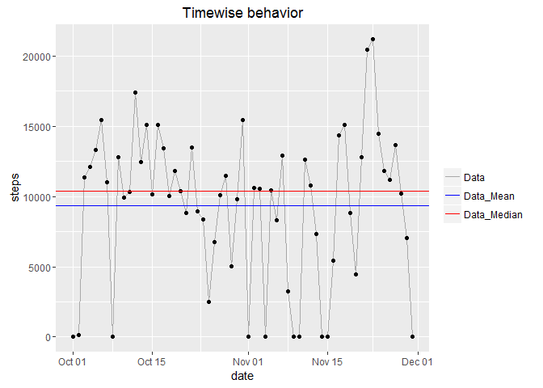
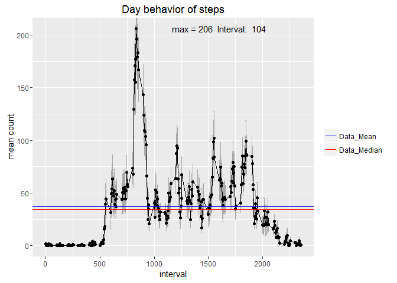
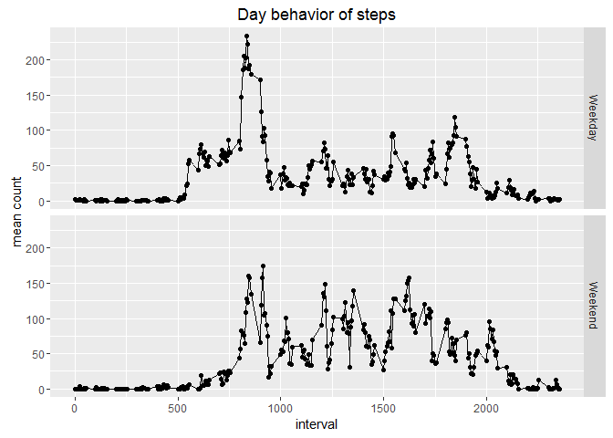
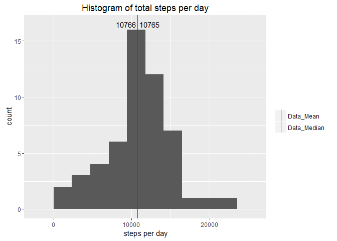

# Reproducible Reseach Project 1

The intention of this document is not only to cover the basics of presenting data in a coherent way but also to answer these following questions:

* What is the distribution of total steps taken each day
* What is the median and mean of the total steps taken each day
* How does the average number of steps taken by day varies in time
* Which is the 5-minute interval that, on average contains the maximum number of steps
* Panel plot comparing the average number of steps taken per 5-minute interval across weekdays and weekends
* Histogram of the total number of steps taken each day after missing values are imputed

###Brief Exploratory Analysis
The first step of the process is loading the information and all the packages that are going to be used:


```r
setwd("D:/datasciencecoursera/rep-reseach/project1")
activity<-read.csv("activity.csv")
library(lattice)
library(ggplot2)
```

The next step is looking into the data and understanding what's inside:


```r
str(activity)
```

```
## 'data.frame':	17568 obs. of  3 variables:
##  $ steps   : int  NA NA NA NA NA NA NA NA NA NA ...
##  $ date    : Factor w/ 61 levels "2012-10-01","2012-10-02",..: 1 1 1 1 1 1 1 1 1 1 ...
##  $ interval: int  0 5 10 15 20 25 30 35 40 45 ...
```

```r
summary(activity)
```

```
##      steps                date          interval     
##  Min.   :  0.00   2012-10-01:  288   Min.   :   0.0  
##  1st Qu.:  0.00   2012-10-02:  288   1st Qu.: 588.8  
##  Median :  0.00   2012-10-03:  288   Median :1177.5  
##  Mean   : 37.38   2012-10-04:  288   Mean   :1177.5  
##  3rd Qu.: 12.00   2012-10-05:  288   3rd Qu.:1766.2  
##  Max.   :806.00   2012-10-06:  288   Max.   :2355.0  
##  NA's   :2304     (Other)   :15840
```

The dataset contains three variables: `steps`, `date` and `interval`. NAs are mostly contained in the steps variable. To understand where are NAs mainly located and what's happening with the data a multipanel plot with both the data withoud NAs and the data with NAs  could ve useful.


```r
activity2<-droplevels.data.frame(activity[complete.cases(activity),])
xyplot(steps ~ interval | date, data=activity,par.strip.text=list(cex=0.6))
```

<!-- -->

```r
xyplot(steps ~ interval | date, data=activity2,par.strip.text=list(cex=0.6))
```

<!-- -->

It is evident that some days have no actual recordings and therefore have no data. When the dataset is stripped of all the NAs those days are no longer plotted. 

###Main asignment 

####Describing the general behavior between days (throughout the month)
In the next plot the general distribution of total steps per day can be easily seen. Mean and median are also plotted and labeled.


```r
activitybyday<-with(activity, tapply(steps,date, function(x) sum(x, na.rm = TRUE)))
activitybyday<-data.frame(date=names(activitybyday), sumsteps=as.numeric(activitybyday))
activitybydaymean<-mean(activitybyday$sumsteps)
activitybydaymedian<-quantile(activitybyday$sumsteps,.50)
ggplot(data=activitybyday, aes(x=activitybyday$sumsteps))+
  geom_histogram(bins=9)+
  geom_vline(aes(xintercept=activitybydaymean,
                 colour="Data_Mean"))+
  geom_vline(aes(xintercept=activitybydaymedian,
                 colour="Data_Median"))+
  labs(title="Histogram of total steps per day",
       x = "steps per day", y = "count")+
  scale_color_manual(name="",values=c(Data_Mean="blue", Data_Median="red"))+
  annotate("text",label=paste(round(activitybydaymean)),x=activitybydaymean-1500,y=16.5)+
  annotate("text",label=paste(round(activitybydaymedian)),x=activitybydaymedian+1500,y=16.5)
```

<!-- -->

The general time behavior can also be obtained in the following plot. 


```r
ggplot(data=activitybyday, aes(y=activitybyday$sumsteps, x=as.Date(activitybyday$date)))+
  geom_line(aes(colour="Data"))+
  geom_point()+
  geom_hline(aes(yintercept=activitybydaymean,
                 colour="Data_Mean"))+
  geom_hline(aes(yintercept=activitybydaymedian,
                 colour="Data_Median"))+
  labs(title="Timewise behavior",
       x = "date", y = "steps")+
  scale_color_manual(name="",values=c(Data_Mean="blue", Data_Median="red", Data="darkgrey"))
```

<!-- -->

####Describing the behavior between intervals (throughout the day)
To understand the mean behaviour throughout the day a point plot can be made for that purpose. The interval in which the maximum mean step count is found is shown with the correspondend maximum mean. 


```r
act_interval<-data.frame(interval=levels(as.factor(activity$interval)),
                         mean=as.numeric(with(activity, 
                                              tapply(steps,interval, function(x) mean(x, na.rm = TRUE)))),
                         semin=as.numeric(with(activity,
                                               tapply(steps,interval,function(x) mean(x, na.rm=TRUE)-sd(x, na.rm = TRUE)/sqrt(length(x))))),
                         semax=as.numeric(with(activity,
                                               tapply(steps,interval,function(x) mean(x, na.rm=TRUE)+sd(x, na.rm = TRUE)/sqrt(length(x))))),
                         stringsAsFactors = FALSE
                         )

act_interval_mean<-mean(act_interval$mean)
act_interval_median<-quantile(act_interval$mean,0.5)
act_interval_max<-max(act_interval$mean)
act_interval_maxcol<-which.max(as.numeric(act_interval$mean))
ggplot(data=act_interval, aes(x=as.numeric(interval),y=mean))+
  geom_errorbar(ymax=act_interval$semax,ymin=act_interval$semin, colour="darkgrey")+
  geom_point()+
  geom_line()+
  geom_hline(aes(yintercept=act_interval_mean,colour="Data_Mean"))+
  geom_hline(aes(yintercept=act_interval_median,colour="Data_Median"))+
  labs(title="Day behavior of steps",x = "interval", y = "mean count")+
  scale_color_manual(name="",values=c(Data_Mean="blue", Data_Median="red"))+
  annotate("text",
           label=paste("max =", 
                       round(act_interval_max),
                       " Interval: ",
                       act_interval_maxcol),
           x=act_interval_maxcol+1500,
           y=act_interval_max)
```

<!-- -->

Given the last plot, a natural question could be asked of wheter or not there are behaviour changes if the days are weekdays or weekends. In the following plot a strong difference can be seen. This difference is probably related to commuting or a exercise routine. 

```r
library(dplyr)
```

```
## 
## Attaching package: 'dplyr'
```

```
## The following objects are masked from 'package:stats':
## 
##     filter, lag
```

```
## The following objects are masked from 'package:base':
## 
##     intersect, setdiff, setequal, union
```

```r
activity$week_weekend<- as.factor(sapply(as.Date(activity$date),
                              function (x) 
                                if (weekdays(x)=="Saturday"|| weekdays(x) == "Sunday"){
                                  "Weekend"
                                }else{
                                  "Weekday"
                                }
                                  ))
act_int_week<-group_by(activity[,c(1,3,4)],interval,week_weekend) %>% summarise_each(funs(mean,"mean",mean(., na.rm=TRUE)))

ggplot(data=act_int_week, aes(x=as.numeric(interval),y=mean))+
  geom_point()+
  geom_line()+
  labs(title="Day behavior of steps",x = "interval", y = "mean count")+
  facet_grid(week_weekend~.)
```

<!-- -->

####The role of NAs
The following plot is very similar to the first histogram but without the NAs. A substantial difference can be seen as R treats the NAs as 0s which lead to a cumulation of counts on the lower part of the histogram. Also the difference between the mean and the median is near 0. The occurrence of that phenomenom is rather natural because the mean is way more susceptible to extreme values than the median. 

```r
activitybyday<-with(activity2, tapply(steps,date, function(x) sum(x, na.rm = TRUE)))
activitybyday<-data.frame(date=names(activitybyday), sumsteps=as.numeric(activitybyday))
activitybydaymean<-mean(activitybyday$sumsteps)
activitybydaymedian<-quantile(activitybyday$sumsteps,.50)
ggplot(data=activitybyday, aes(x=activitybyday$sumsteps))+
  geom_histogram(bins=9)+
  geom_vline(aes(xintercept=activitybydaymean,
                 colour="Data_Mean"))+
  geom_vline(aes(xintercept=activitybydaymedian,
                 colour="Data_Median"))+
  labs(title="Histogram of total steps per day",
       x = "steps per day", y = "count")+
  scale_color_manual(name="",values=c(Data_Mean="blue", Data_Median="red"))+
  annotate("text",label=paste(round(activitybydaymean)),x=activitybydaymean-1500,y=16.5)+
  annotate("text",label=paste(round(activitybydaymedian)),x=activitybydaymedian+1500,y=16.5)
```

<!-- -->
